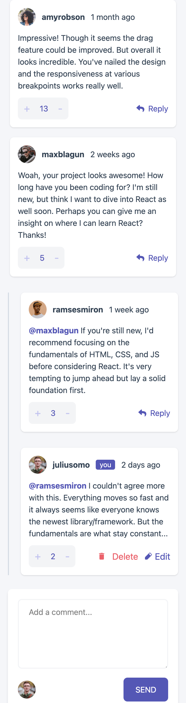
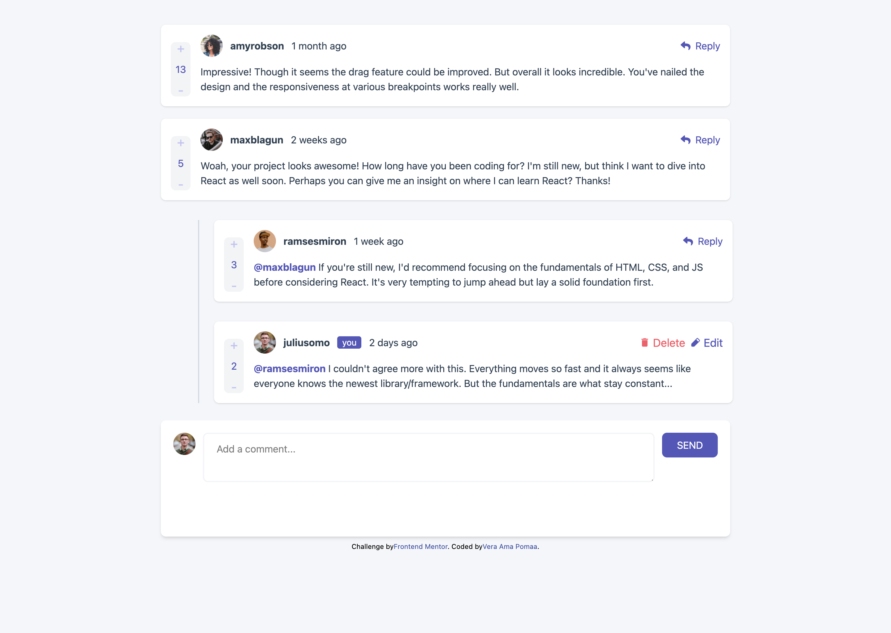

# Frontend Mentor - Interactive comments section solution

This is a solution to the [Interactive comments section challenge on Frontend Mentor](https://www.frontendmentor.io/challenges/interactive-comments-section-iG1RugEG9).

## Table of contents

- [Overview](#overview)
  - [Screenshot](#screenshot)
  - [Links](#links)
- [My process](#my-process)
  - [Built with](#built-with)
  - [What I learned](#what-i-learned)
  - [Continued development](#continued-development)
- [Author](#author)

## Overview

### Screenshot

### Links

- Solution URL: 
- Live Site URL: 

## My process

### Built with

- Semantic HTML5 markup
- CSS custom properties
- Flexbox
- CSS Grid
- Mobile-first workflow
- [React](https://reactjs.org/) - JS library
- [Tailwind CSS](https://https://tailwindcss.com/) - For styles

### What I learned

This is a CRUD App so I learnt how to create new comments, add replies to comments,delete a reply and making updates to comments.

Using Reactjs, Tailwindcss and motion, I designed and made the original design come to live for a better user experience.

### Continued development

I would like to do the dark mode for the version this already created one.

## Author

- Website - [Vera Ama Pomaa](https://www.your-site.com)
- Frontend Mentor - [@vera-poms](https://www.frontendmentor.io/profile/vera-poms)
